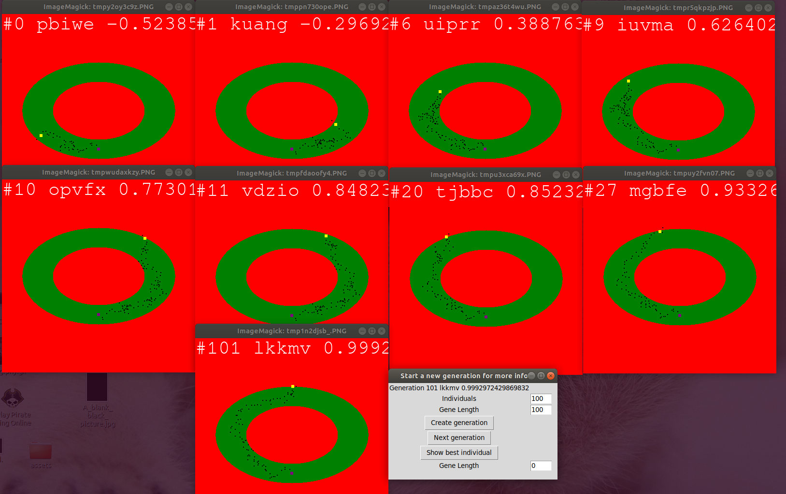
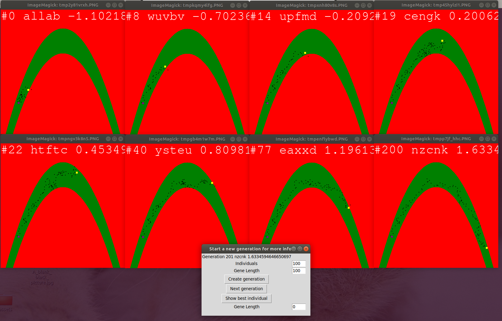

# race-nation
Genetic algorithm for car races.

Defining the following problem: There is an individual (agent) with a starting position that is able to move in anywhere in a rectangle. The field might be accesible (green) or inaccessible(red). If the agent ends up in an inaccessible region, then the is stopped and no further genes are evaluated.

The genes consist in steps. For each generation there will be breeding between the best individuals and possible mutations. The fitness function should be defined to evaluate the agents.

## How does it work

An individual consists of a list of genes. Each gene is defined by 2 float values denoting a step is made in the direction (x, y) from the current position. So an individual defines a route by taking multiple consecutive (persistent) steps.

One generation is made of more individuals. When the first generation is created, the genes are randomly generated. When we want to take the generation to the next epoch we take the best individuals and randomly cross over their genes. Also keeping the best individuals intact (so randomness will not generate lower scores and lose progress). Also individuals can have random mutations meaning that some genes are changing. This will ensure that our generation will have some diversity and evolution over epochs.

The fitness functions sorts individuals from best to worst and helps us evaluate which individual is good for breeding.

## Examples

### Interface

The first text in the interface represents Generation <generation_number> <best_individual_name> <best_fitness_score>

In the menu you will find the following buttons
 - Create generation
 
   By default there is no loaded generation, so the other buttons are useless until you press this first. The generation has the number of individuals and the genes length from the input fields above.
 - Next generation
 
   Breeds the individuals and mutates them, taking the group of individuals to the next generation
 - Show best individual
 
   Displays an image with the best individual. The purple dot is the starting position, the yellow dot is the last valid position, and the black dots are the steps. The green zone is the accessible zone, while the red is the inaccessible
   

### Cases

#### Circle - max Y coordinate fitness

In this example the individuals are tested to go as high as possible on the Y axis. The interesting part of this example is that the individuals can take 2 different routes, left or right. We can see in this run of the case that there were a lot of unexpected turn of events regarding the best individual's route. We can also see that some individuals choke at early stages taking a lot of back and forth steps (this is irrelevant since time does not count in the fitness function, but is a nice observation), generation #11. While other individuals take very big steps forward.

Some runs of this case might end up having the the best individual only on a single side, this is due to a very fast development of an individual and taking over all the individuals in the generation by breeding and mutations. If an individual is the best during about 5-10 generations, then is most probably that its genes will be the in the most individuals, eradicating the other side individuals.

### 2nd grade curve - max X coordinate fitness

In this example the individuals are tested to go as far as possible on the X axis. The interesting part of this case is how the individuals must change the direction when they are at the peak of the curve. There are not very special observations on this example, except of how the individuals choke and how / when they break this plateau of back and forth steps.

In this run we can see how the best individual of the generation #200 takes very big forward steps, while the previous generations are really struggling to break some local inefficiencies. Example is generation #40 where the best individuals stalles a lot on the peak of the curve.

